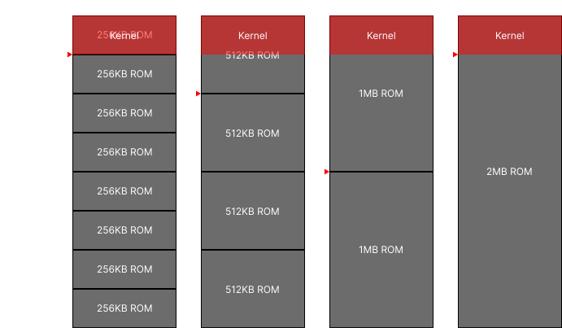
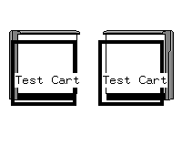

# Game.com cartridge documentation

This documentation provides a detailed explanation of the Game.com cartridge/ROM format, covering header structure, security checks and icon preparation.

## Header

|          | Length  | Description           |
|----------|---------|-----------------------|
| **0x00** | 1 byte  | Unknown               |
| **0x01** | 1 byte  | Program entry bank    |
| **0x02** | 2 bytes | Program entry address |
| **0x04** | 1 byte  | Flags                 |
| **0x05** | 9 bytes | Cartridge string      |
| **0x0E** | 1 byte  | Icon bank             |
| **0x0F** | 2 bytes | Icon location         |
| **0x11** | 9 bytes | Program string        |
| **0x1A** | 2 bytes | Program ID            |
| **0x1C** | 1 byte  | Security checksum     |
| **0x1D** | 3 bytes | Padding (0x00)        |

### Unknown

**1 byte/u8**

This value isn't read anywhere within the kernel; its purpose is currently unknown.

I recommend leaving this as 0x00 for homebrew titles.

### Program entry bank

**1 byte/u8**

The bank the program code starts at.

Banks are in 8KB units; the first 256KB - banks `0x00` to `0x20` - are mapped to the inbuilt external ROM (the kernel).

ROM data is effectively mirrored throughout the entire 2MB address space, as writes to upper address lines beyond the capacity of the ROM chip are ignored.

Lowest possible entry bank per common ROM size:
|           | Bank   |
|-----------|--------|
| **256KB** | `0x20` |
| **512KB** | `0x40` |
| **1MB**   | `0x80` |
| **2MB**   | `0x20` |

Note: For 2MB ROM chips, only 1.744MB is usable. Insert 256KB of leading padding when preparing a ROM image.

Visualised:



### Program entry address

**2 bytes/u16** (big-endian)

The program code entrypoint address.

Relative to start of entry bank in MMU2 (`0x4000`-`0x5FFF`).

Typically `0x4020` if entrypoint directly after header. 

### Flags

**1 byte/u8**

Bitwise flags used for cartridge configuration.

**Bit 0**: Cartridge allowed in slot 1

**Bit 1**: Cartridge allowed in slot 2

**Bit 2**: `0` = program cartridge, `1` = data-only cartridge

**Bit 3**: `0` = uncompressed icon, `1` = compressed icon

**Bit 4**: Checked if bit 3 set, but ultimately unused.

Bits 0 and 1 should be set to allow the cartridge to be played in both slots.

### Cartridge string

**9 bytes**

A string used for verifying cartridge integrity.

Must be `TigerDMGC`. Stands for 'Tiger Dot Matrix Game Cartridge'.

### Icon bank

The bank the icon data is located in.

Can be set to `0x00` for no icon.

#### If uncompressed:

**1 byte/u8** - Image bank

Unlike regular memory banks, image banks are 16KB (256 x 256 x 2 bits).

Image banks must therefore be aligned to 16KB and cannot start on an 8KB memory bank boundary.

For example, image bank `0x21` is memory bank `0x42`.

#### If compressed:

**1 byte/u8** - Memory bank

### Icon location

The location of the icon data within the bank.

Not read if no icon indicated.

#### If uncompressed:

**1 byte/u8** - Icon X coordinate

**1 byte/u8** - Icon Y coordinate

These are coordinates within the 256 x 256 image bank.

#### If compressed:

**2 bytes/u16** (big endian) - Icon address

Relative to start of icon bank in MMU3 (`0x6000`-`0x7FFF`).

### Program string

**9 bytes**

A string unique to the program.

Drawn on cartridge selection screen if no icon indicated.

### Program ID

**2 bytes/u16** (big-endian)

A unique ID used for saving and security operations.

Can be set to `0x0000` if saving not required.

### Security checksum

**1 byte/u8**

A checksum used for verifying cartridge integrity.

Calculated by summing both program ID bytes together in 8 bits and XORing with `0xA5`.

## Security

In addition to the checksum calculation described in the header documentation, there is another more involved security check which must be passed for the cartridge to be allowed to boot.

The values at three predetermined locations within the ROM data are summed in 8 bits and must equal `0x5A`.

These locations are stored in a table, the index decided by the last 4 bits of the security checksum (`AND 0xF`):

|         | Address 1 | Address 2 | Address 3 |
|---------|-----------|-----------|-----------|
| **0x0** | `0x33E4`  | `0x5757`  | `0x6666`  |
| **0x1** | `0x1245`  | `0x3505`  | `0x4707`  |
| **0x2** | `0x2267`  | `0x635A`  | `0x7ABC`  |
| **0x3** | `0x1AC2`  | `0x36BB`  | `0x84E3`  |
| **0x4** | `0x4F27`  | `0x56E1`  | `0x7FDB`  |
| **0x5** | `0x08A7`  | `0x6B41`  | `0x5673`  |
| **0x6** | `0x0245`  | `0x33BE`  | `0x8B6F`  |
| **0x7** | `0x1743`  | `0x5F7E`  | `0x6376`  |
| **0x8** | `0x2875`  | `0x3764`  | `0x4FD0`  |
| **0x9** | `0x230F`  | `0x44E7`  | `0x67B1`  |
| **0xA** | `0x2209`  | `0x34F1`  | `0x3AA8`  |
| **0xB** | `0x200D`  | `0x33C9`  | `0x63EC`  |
| **0xC** | `0x39A7`  | `0x5F4B`  | `0x6078`  |
| **0xD** | `0x1327`  | `0x224C`  | `0x7086`  |
| **0xE** | `0x2903`  | `0x4F72`  | `0x6600`  |
| **0xF** | `0x1108`  | `0x3ABB`  | `0x590A`  |

## Icon

Cartridges can contain an icon which gets displayed on the selection screen when two cartridges are inserted.

This icon is 64 x 64 pixels in size, and can be either within an image bank or stored as compressed data.

When no icon is specified (icon bank `0x00`), a rudimentary square and the program string are drawn:



### Compression

Uses a simple form of run-length encoding; found in syscall `Fi_graph2`.

Like all other image data on the Game.com, it is rotated 270 degrees and flipped horizontally prior to being compressed.

For a compressor implementation, please see `gcimagetool`.

Here is a C implementation of a decompressor:

```c
uint16_t decompress(uint8_t *in, uint8_t *in_end, uint8_t *out)
{
	uint8_t  ch, *out_start;
	uint16_t rl;

	out_start = out;

	while (in < in_end)
	{
		ch = *in++;

		if (ch < 0xc0) // Literal (in range)
		{
			*out++ = ch;
		}
		else if (ch == 0xc0) // RLE (16-bit)
		{
			rl = (in[1] << 8) | in[0];
			ch = in[2];
			in += 3;

			while (rl--)
				*out++ = ch;
		}
		else if (ch == 0xc1) // Literal (out of range)
		{
			*out++ = *in++;
		}
		else // RLE (6-bit)
		{
			rl = ch & ~0xc0;
			ch = *in++;

			while (rl--)
				*out++ = ch;
		}
	}

	return out - out_start;
}
```
